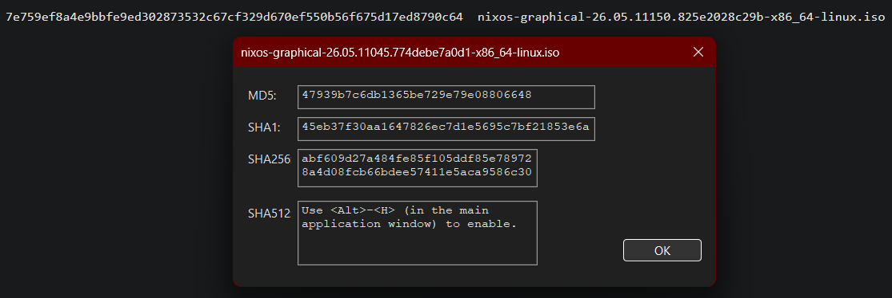
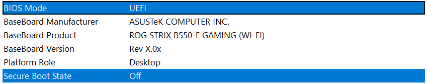

# 2026-10-04: Phase 0, Preparation

**Goal:** Prepare the PC for the NixOS installation.

## What I did

1. Created a private GitHub repo with an MIT license and the Nix `.gitignore` template, turned on GitHub's email privacy settings, and edited .gitignore to ensure common secrets stay hidden.
2. Downloaded the NixOS ISO and verified its SHA256 hash against the published one, wrote the ISO to a USB stick using Rufus in DD Image mode.

3. Checked BitLocker status with `manage-bde -status`.
4. Verified Secure Boot is off and the firmware is in UEFI mode (msinfo32).

5. Organized uploaded screenshots for better reference management during documentation.

## What broke or surprised me

- First time using .md/Markdown files, didn't realize indented files are rendered as code, so had issues with formatting initially.

> [!NOTE]
>  My 1TB NVMe (C:) is not encrypted. My 3TB data drive (D:) is BitLocker-encrypted but has no key protectors and protection off, which is fine for the installation but will be unreadable in Linux. I'll decide what to do with D: drive during the storage phase later on.

## Decisions

- Will keep this repo private until gitleaks confirms everything is clean.
- Chose the formatting for journal entries to document this journey.
- Also chose the file organization structure for this repo, at least for imgs and journals. Later stuff will be added as needed.

## Next

Phase 1: start NixOS installation on my 1TB 2.5" SSD (secondary drive).
