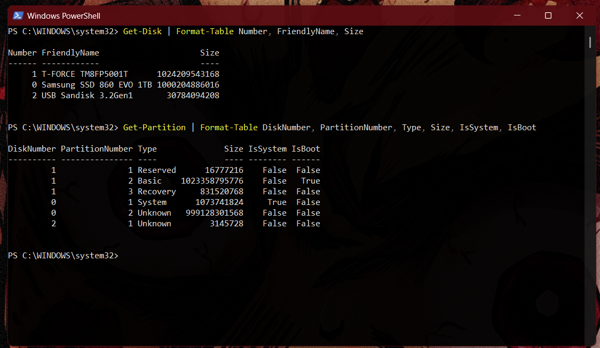

# 2026-10-05: Phase 1, installing NixOS

**Goal:** Install a minimal NixOS on the Samsung SSD (Testing before daily-driving on my NVME).

**Result:** A text-only NixOS 26.05 system (`toph`) built from a flake with Home Manager, with Windows made independent of the test SSD along the way. Tags `v0.1-minimal-install` and `v0.2-flake-home-manager`.

## What I did

### Inspecting the machine (read-only)
- Booted the NixOS 26.05 live USB (Plasma, LTS kernel) and collected a hardware inventory.
- Identified the disks with `lsblk`.

### Windows was booting from my Linux test SSD
- The Windows NVMe had no EFI System Partition. `efibootmgr` showed "Windows Boot Manager" pointing at the Samsung's EFI partition, a read-only mount showed `EFI/Microsoft` on it, and PowerShell's `IsSystem`/`IsBoot` check confirmed it. Wiping the Samsung would have broken Windows. 
- The fix, from Windows with the 3TB HDD unplugged: shrank C: by 600 MiB, created an EFI partition on the NVMe with `diskpart`, and copied the boot files.
- Finally, with the Samsung unplugged, Windows booted on its own and `IsSystem` moved to the NVMe.

### Partitioning and installing
- Wiped the Samsung and created a 1 GiB EFI partition plus an ext4 root. Unencrypted for now.
- `nixos-generate-config` wrote `hardware-configuration.nix` (detected hardware, never edited by hand). I replaced the template `configuration.nix` with my own minimal one.
- `nixos-install`, then set passwords with `passwd` so none are stored in the config.

### First rebuild and GitHub
- Learned `nixos-rebuild test` (try it now; a reboot undoes it), `switch` (make it the default) and `boot`, plus generations as rollback points.
- Created an SSH key with a passphrase and logged into GitHub with `gh`. Added the key for authentication and for commit signing, and checked GitHub's host key fingerprint before trusting it.
- Moved the config into this repo under `hosts/toph/` and added a gitleaks pre-commit hook that scans every commit for secrets.

### Flake and Home Manager
- `flake.nix` pins nixpkgs `nixos-26.05` and Home Manager `release-26.05` (using `follows` so both share one nixpkgs). `flake.lock` records the exact versions.
- Home Manager now manages my git identity, SSH signing and `~/.bashrc`, with `rebuild-test` and `rebuild` aliases (`nixos-rebuild … --flake ~/nixos-setup#toph --sudo`).

## What broke or surprised me

- **The hidden Windows dependency** described above. It was only found because I identified every disk before running anything destructive.
- **Network didn't work after the install.** The DHCP gave out the wrong IP address (192.168.0.x instead of 192.168.100.x), will need to investigate further. I set it manually with `nmcli`.
- **My first commit showed "Unverified"** because the no-reply email was missing the `+`. Fixed it with `git commit --amend --reset-author` and `git push --force-with-lease`.

## Decisions

- **Give Windows its own EFI partition** instead of keeping it on the test SSD, so Windows is self-contained and the SSD stays disposable.
- **Unencrypted ext4 for the test install.** Encryption comes in a later reinstall drill, possibly when making the final move to the NVME.
- **Plain `configuration.nix` first, then a flake**, so I understood what I was converting.
- **Edit the config as my user in the repo** and apply it with `--sudo`, rather than editing as root in `/etc/nixos`.

## Next

Phase 2: graphical desktop, with KDE Plasma as the baseline.
